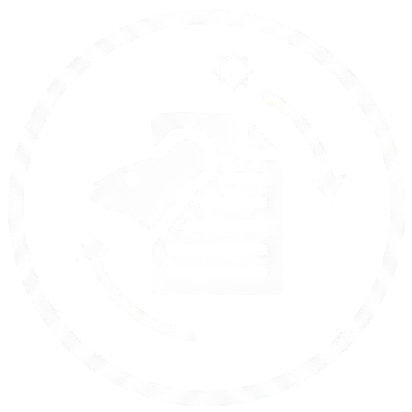
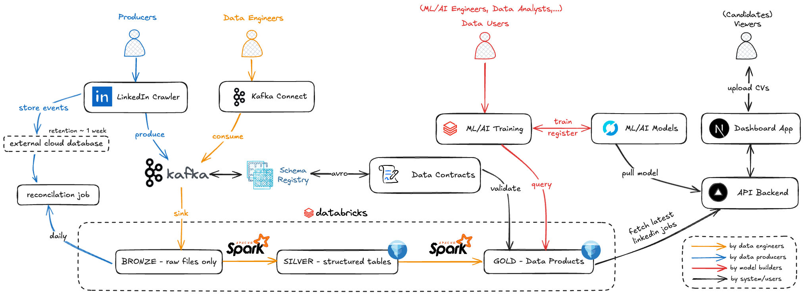
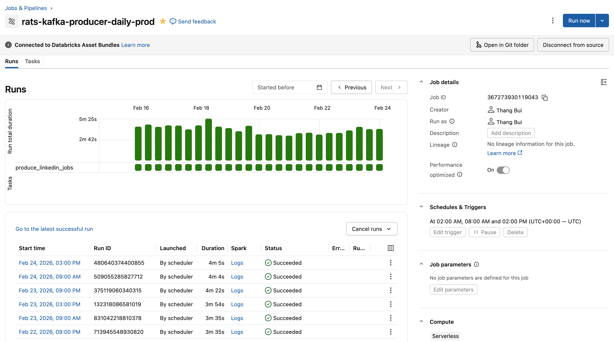
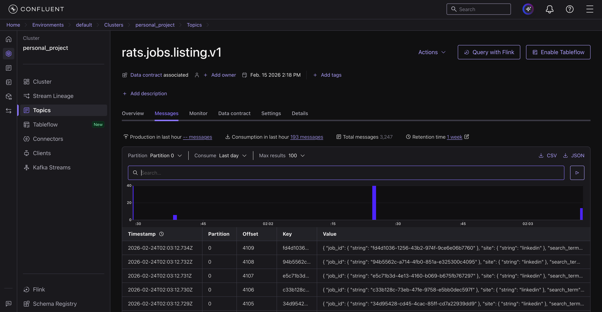
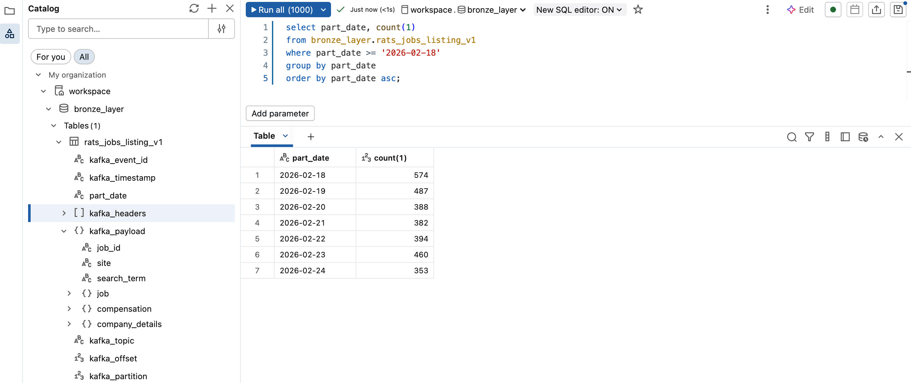
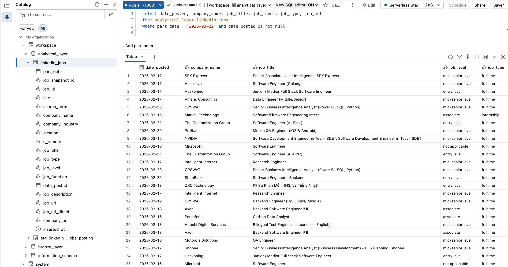

<div align="center">

<h3>RATS - Reversed ATS Platform </h3>

Reversed ATS platform, a platform for analyzing job market trends, predicting salaries, and matching candidate to jobs market using real-time data from LinkedIn and Glassdoor.

</div>

<div align="center">
<a href="https://databricks.com" target="_blank">

</a>
<a href="https://spark.apache.org/" target="_blank">

</a>
<a href="https://www.confluent.io/confluent-cloud/" target="_blank">

</a>
</div>

## Platform Features

In development, the RATS platform includes the following key features:

- Real-time Job Data Crawling: Automated daily scraping from LinkedIn.
- Job-Resume Matching: Smart matching system using NLP and embeddings.

Planned features include:

- Salary Prediction: ML models to predict salaries based on skills, location, and experience using data from Glassdoor or other Vietnamese job platforms like 1900.com.vn...
- Tech Stack Extraction: NER-based automatic skill extraction from job descriptions.

## Table of Contents

- [Platform Features](#platform-features)
- [Table of Contents](#table-of-contents)
- [Monorepo Structure](#monorepo-structure)
- [Architecture Overview](#architecture-overview)
- [Process Showcase](#process-showcase)
- [Output Schema](#output-schema)
- [Quick Start](#quick-start)
- [Prerequisites](#prerequisites)
- [Development](#development)

## Monorepo Structure

This project is designed to provide insights into the job market by leveraging machine learning and data engineering techniques. It includes components for data crawling, preprocessing, model training, and deployment, all orchestrated through a robust MLOps pipeline.

The monorepo is organized into the following key components:

- [rats-dashboard-api](./rats-dashboard-api): FastAPI application for serving models and providing prediction APIs
- [rats-dashboard-app](./rats-dashboard-app): Next.js application for visualizing job market insights
- [rats-dbt-transformer](./rats-dbt-transformer): dbt models for transforming raw data into analysis-ready datasets
- [rats-kafka-consumer](./rats-kafka-consumer): Spark Streaming application for consuming and preprocessing data from Kafka
- [rats-kafka-producer](./rats-kafka-producer): Data contract definitions and producer application for sending crawled data to Kafka
- [rats-vectordb-materializer](./rats-vectordb-materializer): Databricks job to materialize analytical jobs into Qdrant vector database

## Architecture Overview

- Data Flow Diagram:

  

- Data Lineage:

  ```text
  LinkedIn Crawler & Producer --> Confluent Cloud Kafka (rats.jobs.listing.v1)
                                                    |
                                                    v
                                  bronze_layer.rats_jobs_listing_v1 (Delta)
                                                    |
                                                    v
  Downstream Analytics & Apps <-- analytical_layer.linkedin_jobs (Iceberg)
                                                    |
                                                    v
  rats-vectordb-materializer ---> Qdrant (linkedin_jobs collection)
                                                    |
                                                    v
  rats-dashboard-api (serve search & CV matching via Qdrant)
  ```

## Process Showcase

- Producer pipeline output (crawl and send to Confluent Cloud Kafka):

  

  

- Consumer Delta output (consume from Kafka, preprocess, and write to Delta Lake):

  

- dbt transformation output (transform raw Delta data into analysis-ready Iceberg tables):

  

## Output Schema

- Raw data output schema after consuming from Kafka and writing to Delta Lake:

  ```text
  root
  |-- kafka_event_id: string (nullable = true)
  |-- kafka_timestamp: string (nullable = true)
  |-- part_date: string (nullable = true)
  |-- kafka_headers: array (nullable = true)
  |    |-- element: struct (containsNull = true)
  |    |    |-- key: string (nullable = true)
  |    |    |-- value: binary (nullable = true)
  |-- kafka_payload: struct (nullable = true)
  |    |-- job_id: string (nullable = true)
  |    |-- site: string (nullable = true)
  |    |-- search_term: string (nullable = true)
  |    |-- job: struct (nullable = true)
  |    |    |-- job_url: string (nullable = true)
  |    |    |-- job_url_direct: string (nullable = true)
  |    |    |-- title: string (nullable = true)
  |    |    |-- company: string (nullable = true)
  |    |    |-- location: string (nullable = true)
  |    |    |-- job_type: string (nullable = true)
  |    |    |-- date_posted: string (nullable = true)
  |    |    |-- is_remote: boolean (nullable = true)
  |    |    |-- job_level: string (nullable = true)
  |    |    |-- job_function: string (nullable = true)
  |    |    |-- listing_type: string (nullable = true)
  |    |    |-- emails: string (nullable = true)
  |    |    |-- description: string (nullable = true)
  |    |-- compensation: struct (nullable = true)
  |    |    |-- interval: string (nullable = true)
  |    |    |-- min_amount: double (nullable = true)
  |    |    |-- max_amount: double (nullable = true)
  |    |    |-- currency: string (nullable = true)
  |    |-- company_details: struct (nullable = true)
  |    |    |-- company_industry: string (nullable = true)
  |    |    |-- company_url: string (nullable = true)
  |    |    |-- company_url_direct: string (nullable = true)
  |    |    |-- company_addresses: string (nullable = true)
  |    |    |-- company_num_employees: integer (nullable = true)
  |    |    |-- company_revenue: string (nullable = true)
  |    |    |-- company_description: string (nullable = true)
  |    |    |-- logo_photo_url: string (nullable = true)
  |    |    |-- banner_photo_url: string (nullable = true)
  |    |    |-- ceo_name: string (nullable = true)
  |    |    |-- ceo_photo_url: string (nullable = true)
  |-- kafka_topic: string (nullable = true)
  |-- kafka_offset: long (nullable = true)
  |-- kafka_partition: integer (nullable = true)
  ```

- Transformed data schema after applying dbt transformations:

  ```text
  root
  |-- part_date: date (nullable = true)
  |-- job_snapshot_id: string (nullable = true)
  |-- job_id: string (nullable = true)
  |-- site: string (nullable = true)
  |-- search_term: string (nullable = true)
  |-- company_name: string (nullable = true)
  |-- company_industry: string (nullable = true)
  |-- company_url: string (nullable = true)
  |-- location: string (nullable = true)
  |-- is_remote: boolean (nullable = true)
  |-- date_posted: date (nullable = true)
  |-- job_title: string (nullable = true)
  |-- job_type: string (nullable = true)
  |-- job_level: string (nullable = true)
  |-- job_function: string (nullable = true)
  |-- job_description: string (nullable = true)
  |-- job_url: string (nullable = true)
  |-- job_url_direct: string (nullable = true)
  |-- inserted_at: timestamp (nullable = true)
  ```

## Quick Start

To quickly get started with the RATS platform, follow these steps after you met the [Prerequisites](#prerequisites):

1. Clone the repository:

```bash
git clone https://github.com/thangbuiq/reversed-ats-platform
cd reversed-ats-platform
```

2. Explore and run individual components:

   Each component of the platform (e.g., `rats-dashboard-app`, `rats-kafka-consumer`, `rats-dashboard-api`, etc.) has its own `README.md` with detailed instructions for running and deploying that service.

   After cloning the repository, navigate to the component you're interested in and follow its README. For example:

   ```bash
   cd rats-dashboard-app
   # follow the instructions in rats-dashboard-app/README.md
   ```

## Prerequisites

Before running the RATS platform, ensure you have the following prerequisites installed:

- `uv`: [Install uv](https://docs.astral.sh/uv/)
- `just` (optional): [Install Just](https://github.com/casey/just)

## Development

In each subdirectory, you will find a `README.md` file with specific instructions for development, testing, and deployment of that component. Please refer to those files for detailed guidance on working with each part of the RATS platform.

But for most components, you can use `uv` to manage your development environment. For example, to set up the environment for the Dagster app:

```bash
cd <component-directory>
uv sync --all-groups --all-extras
```

And develop the component as needed.
