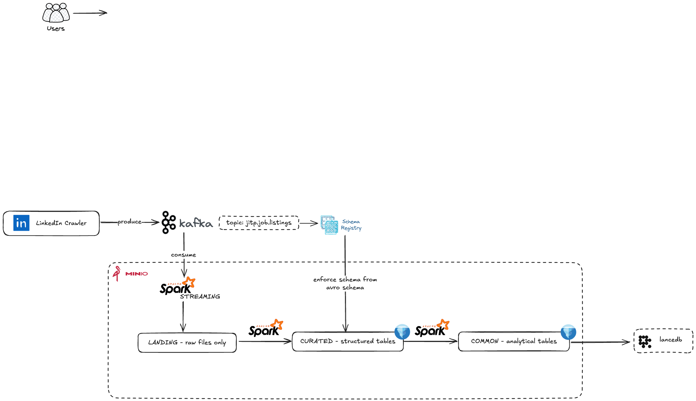

# Job Market Intelligence Platform

An end-to-end MLOps platform for analyzing job market trends, predicting salaries, and matching candidates to jobs using real-time data from Glassdoor (for salary range) and LinkedIn job postings.

## Table of Contents

- [Job Market Intelligence Platform](#job-market-intelligence-platform)
  - [Table of Contents](#table-of-contents)
  - [Architecture Diagram](#architecture-diagram)
  - [Monorepo Structure](#monorepo-structure)
  - [Features](#features)

## Architecture Diagram



## Monorepo Structure

This project is designed to provide insights into the job market by leveraging machine learning and data engineering techniques. It includes components for data crawling, preprocessing, model training, and deployment, all orchestrated through a robust MLOps pipeline.

```bash
job-market-intelligence-platform/
├── jitp-kafka-setup/             # Kafka setup and configurations (docker-compose)
├── jitp-kafka-producer/          # Data Crawling and produce to Kafka
├── jitp-kafka-consumer/          # Spark Streaming Consumer for preprocessing and feature engineering
├── jitp-dbt-transformer/         # dbt models for data transformation
├── jitp-mlops-setup/             # Docker setup for MLOps components (docker-compose)
├── jitp-model-training/          # Model training scripts and notebooks
├── jitp-model-serving/           # Model serving with FastAPI
├── jitp-dashboard-app/           # Next.js app for visualizing insights (hosted on Vercel)
└── README.md                     # Project documentation
```

## Features

- Real-time Job Data Crawling: Automated daily scraping from LinkedIn and Glassdoor
- Salary Prediction: ML models to predict salaries based on skills, location, and experience
- Skills Demand Forecasting: Time series analysis of trending tech skills
- Job-Resume Matching: Smart matching system using NLP and embeddings
- Tech Stack Extraction: NER-based automatic skill extraction from job descriptions
- MLOps Pipeline: Complete CI/CD with monitoring, versioning, and automated retraining
